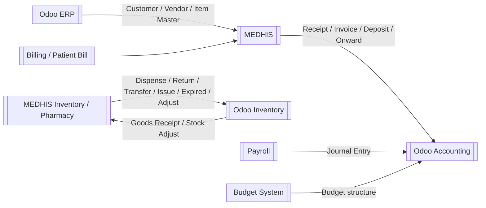

# HIS ERP Interface — การเชื่อมต่อ MEDHIS กับ Odoo ERP

## Overview

[HIS ERP Interface](/concepts/his-erp-interface/) คือชุดการรับส่งข้อมูลระหว่าง MEDHIS และ [Odoo ERP](/modules/odoo-erp/) เพื่อให้ข้อมูลบัญชี รายได้ และสต็อกของโรงพยาบาลสอดคล้องกันโดยอัตโนมัติ ใช้ RESTful API / JSON เป็นรูปแบบหลัก และมีบาง flow ที่อ้างถึง file/log ตามรอบประมวลผล.

## Interface Groups

| Group | Direction | Frequency / Trigger | Main Purpose |
|-------|-----------|---------------------|--------------|
| Customer Master | Odoo → MEDHIS | Manual master alignment / API | Payor/customer reference for billing |
| Vendor Master | Odoo → MEDHIS | Manual master alignment / API | Vendor reference for procurement/accounting |
| Item Master | Odoo → MEDHIS | Immediate after ERP save | Create/update HIS Item Master by item code |
| HIS Receipt | MEDHIS → Odoo | Daily 00:01 | Receipt revenue and payment posting |
| HIS Invoice | MEDHIS → Odoo | Daily 00:01 | Invoice / debtor posting |
| HIS Onward | MEDHIS → Odoo | Monthly, first day of next month | IPD ward revenue accrued but not billed |
| Goods Receipt | Odoo → MEDHIS | Immediate after ERP save | ERP receiving updates HIS stock ledger |
| Stock Adjust | Odoo → MEDHIS | Immediate after ERP save | ERP adjustment updates HIS stock ledger |
| Dispense / Dispense Return | MEDHIS → Odoo | Daily 00:01 | Patient sale and return stock movements |
| Transfer / Issue / Expired Goods / HIS Stock Adjust | MEDHIS → Odoo | Daily 00:01 | HIS stock movement updates ERP stock |
| Payroll | Payroll → Odoo | Prepared route | Journal entries for salary accounting |
| Budget | Budget → Odoo | Prepared route | Budget planning fields in Odoo |

## Environments

| Environment | HIS Endpoint | ERP Endpoint |
|-------------|--------------|--------------|
| UAT | `10.128.12.72`, `interface1-uat.kmch.local:7105` | `roots-odoo-uat-1.kmch.local` |
| Production | `10.128.12.19`, `interface1-prd.kmch.local:7105` | `roots-odoo-prd-1.kmch.local` |

## Core Field Groups

| Data Type | Key Fields |
|-----------|------------|
| Customer Master | code, name, customer_type, tax_id, company name, address |
| Vendor Master | code, name, tax_id, address |
| Item Master | code, name, description, uom_code, store_codes, type_code (`INV_MED`, `INV_MEDSUP`) |
| Receipt / Invoice | document id/name/ref, customer, patient_code, patient_name, episode_type, VN/AN, doctor_code, invoice_date, journal_code, account/cost/profit code, amount |
| Onward | generated id, patient name, HN, date, move_type `entry`, revenue lines, account/cost/profit code, balance |
| Goods Receipt / Stock Adjust | doc_no, doc_year, posting_date, store_code, item_no, item_code, batchid, expiry_date, uom_code, quantity |
| Stock Movement Outbound | id, name, source, destination, date, product_code, cost_code, profit_code, batch, quantity |

## Test Result Summary

| Interface | Test Result |
|-----------|-------------|
| Master Data | ผ่าน |
| Revenue: Receipt / Invoice / Onward | ผ่าน |
| Inventory: Good Receipt / Stock Adjust inbound | ผ่าน |
| Inventory: Dispense / Return / Transfer / Issue / Expired / Adjust outbound | ผ่าน |
| Budget route | ผ่าน / พร้อม |
| Payroll route | ผ่าน / พร้อม |

## Operational Rules

- Odoo and HIS Store/Location master data must match for medicine and medical supplies.
- For medicine and medical-supply movement, users operate in HIS and Odoo receives end-of-day movement data.
- Stock Adjust from ERP to HIS applies to items with existing HIS transaction history.
- If mapped values are missing, Odoo should surface the error so users can fix the field and rerun.
- Interface logs are retained under source-specified log paths such as `/exchange_logs/item-master`, `/exchange_logs/good-receipt`, `/exchange_logs/stock-adjust`, `/exchange_logs/mm`, and finance logs.

## Related Workflows

- [MEDHIS Odoo Revenue Interface Workflow](/workflows/medhis-odoo-revenue-interface-workflow/)
- [MEDHIS Odoo Inventory Interface Workflow](/workflows/medhis-odoo-inventory-interface-workflow/)

