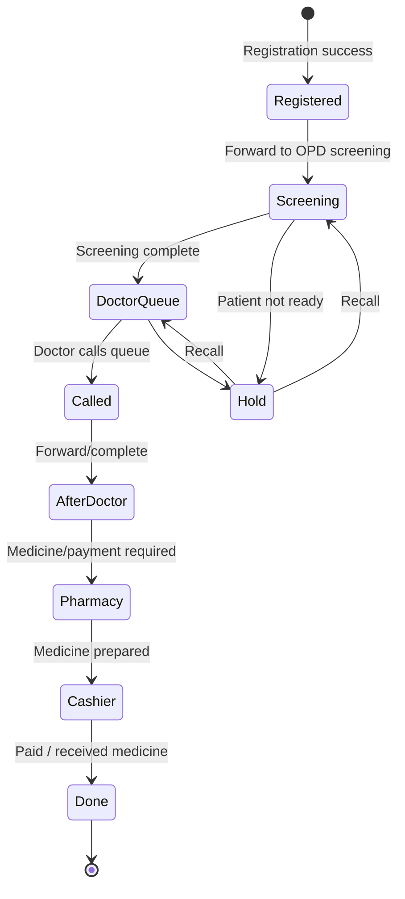

# Queue Status and Routing — สถานะและการส่งต่อคิว

## Overview

ระบบ [Queue Management](/modules/queue-management/) ใช้แนวคิด Worklist + Dashboard โดยแยกสถานะคิวตามจุดบริการและห้อง เพื่อให้ผู้ป่วยถูกเรียก พัก ส่งต่อ หรือจบคิวตามเส้นทางบริการจริง.

## Core Queue States

| State / Tab | Meaning | Typical Actor |
|-------------|---------|---------------|
| รอรายงานตัว | ผู้ป่วยถูกส่งมาถึงจุดบริการ แต่ยังไม่ได้ report | NurseOPD |
| รอเรียก | ผู้ป่วยพร้อมรอเรียกเข้าห้องหรือช่องบริการ | Doctor, NurseOPD, Pharmacist |
| คิวที่เรียก / Calling | ผู้ป่วยถูกเรียกแล้วหรือถูก assign เข้าห้อง/จุดพักคอย | Staff at service point |
| พักคอย | สถานะพักหลังจุดบริการหนึ่งและรอจุดถัดไป | NurseOPD |
| ออกจากคิว | กระบวนการบริการจบแล้ว ชื่อหายจาก Dashboard | Cashier / final service point |

## Routing Pattern

## Queue Number

Queue No. is generated from the last 4 digits of Visit Number (VN). This makes Queue depend on successful [Registration](/modules/registration/) and a valid visit.

## Department / Room Rules

| Setting | Effect |
|---------|--------|
| Department Type = OPD + Default Room | Patient appears at Calling tab and default room is selected automatically |
| Login without room | User sees all patients in the department |
| Login with room | User sees only patients assigned to selected room |
| Forward configuration | Controls which destination departments appear when a room-specific user completes/forwards a queue |

## Display Refresh

| Surface | Refresh Interval |
|---------|------------------|
| Worklist | Every 2 minutes |
| Dashboard | Every 1 minute |

## Related Pages

- [Queue Management](/modules/queue-management/)
- [Queue Worklist Screen](/entities/queue-worklist-screen/)
- [Queue Dashboard](/entities/queue-dashboard/)
- [Queue Registration to Pharmacy Cashier Workflow](/workflows/queue-registration-to-pharmacy-cashier-workflow/)

