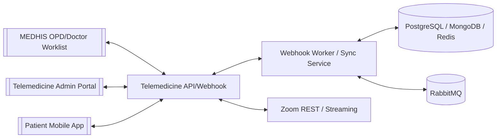

# Telemedicine — ระบบการแพทย์ทางไกล

## Purpose

ระบบ [Telemedicine](/modules/telemedicine/) หรือแอป "หมอพระจอม" ให้บริการนัดหมายและปรึกษาแพทย์ทางไกล โดยเชื่อมกับ MEDHIS สำหรับข้อมูลผู้ป่วย แพทย์ นัดหมาย และการเริ่มโทรจากฝั่ง OPD/Doctor Worklist.

## Architecture

## Technical Stack

| Layer | Technology |
|-------|------------|
| Backend | Golang 1.24.0 |
| Frontend | Vue.js 4.3.0 |
| Mobile | Flutter 3.29.2 |
| Runtime | Docker 28.1.1 |
| Data/services | PostgreSQL 17.4, MongoDB 5.0.29, Redis 7.4.5, RabbitMQ 4.0.7 |
| Integration | MEDHIS webhook/database sync, Zoom teleconference module |

## Main User Functions

| Actor | Functions |
|-------|-----------|
| Patient | Verify account, login, PIN/biometric, view doctors, view appointments, answer doctor call, chat, rate doctor, edit health/emergency-contact info |
| Doctor / Nurse | Create/manage appointment in MEDHIS, call patient from [Doctor Worklist Screen](/entities/doctor-worklist-screen/), record treatment, order medication, issue medical certificate, discharge |
| Telemedicine Admin | Call report, patient and doctor information, admin user management, app settings, legal documents, license information |
| Telemedicine IT Operator | SSH/VPN access, Docker status/logs, server monitoring, disk checks, restart service |

## Appointment Status

| Status | Meaning |
|--------|---------|
| Booked | อยู่ระหว่างจองหรือรอยืนยัน |
| Confirmed | ยืนยันนัดหมายแล้ว |
| Completed | ปรึกษาสำเร็จแล้ว |
| Miss Call | ผู้ป่วยไม่รับสายแพทย์ |
| Reschedule | เลื่อนนัด |
| Cancelled | ยกเลิกนัด |
| No Show | ไม่มาตามนัด |

## Key Workflows

- [Telemedicine Visit Workflow](/workflows/telemedicine-visit-workflow/)
- [Telemedicine Operations Support Workflow](/workflows/telemedicine-operations-support-workflow/)

## Screens / Entities

- [Telemedicine Mobile App](/entities/telemedicine-mobile-app/)
- [Telemedicine Admin Portal](/entities/telemedicine-admin-portal/)

## Verification Evidence

- Training and UAT: ผ่าน
- Readiness checklist: ผ่านทุกหัวข้อ
- Production installation: 17 ตุลาคม 2568
- Go Live: 20 ตุลาคม 2568 เวลา 08:00

## Security Notes

- Source PDFs contain environment credentials. They are intentionally not copied into wiki pages.
- Patient app requires HN/DOB/national ID verification and first-login acceptance of terms, privacy policy, and consent.
- Personal demographics are read-only in app; corrections must go through [Registration](/modules/registration/) / เวชระเบียน.

