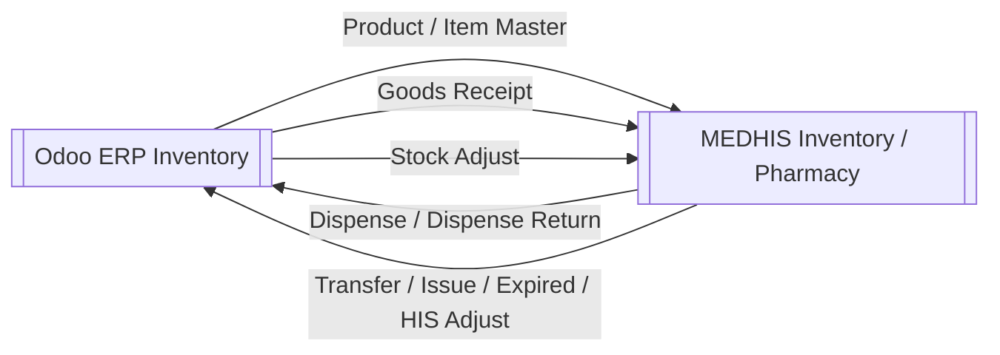

# MEDHIS Odoo Inventory Interface Workflow

## Overview

Synchronizes medicine and medical-supply master data and stock movements between [Odoo ERP](/modules/odoo-erp/) and MEDHIS.

## Interface Directions

## Steps: Odoo To MEDHIS

1. Odoo user creates/updates Product or completes Goods Receipt / Inventory Adjustment.
2. Odoo sends REST/JSON payload to HIS endpoint.
3. MEDHIS logs request.
4. MEDHIS validates Item, Store/Location, UOM, batch, expiry, and quantity.
5. MEDHIS creates or updates Item Master, Goods Receipt, Stock Ledger, or Stock Adjustment.
6. MEDHIS stores interface result and returns success/failure response.

## Steps: MEDHIS To Odoo

1. HIS captures stock movement from Pharmacy/Inventory workflows.
2. End-of-day job selects daily movements such as Dispense, Dispense Return, Transfer, Issue, Expired Goods, and HIS-side Stock Adjust.
3. HIS generates outbound movement payload/log.
4. Odoo receives and validates movement against Product/Location/Lot mappings.
5. Odoo updates stock movement and accounting-relevant inventory state.
6. Errors are surfaced in ERP for mapping correction and rerun.

## Movement Types

See [Odoo Inventory Movement Types](/concepts/odoo-inventory-movement-types/) for sign rules, HN rules, batch/expiry behavior, and field-level movement mapping.

| Movement | Meaning |
|----------|---------|
| Z01 | OPD sale |
| Z02 | OPD sale return |
| Z03 | IPD sale |
| Z04 | IPD sale return |
| 311 | Cross-store transfer |

## Important Rules

- HIS Store and Odoo Location must match for medicines and medical supplies.
- Goods Receipt quantity from Odoo to HIS must be positive.
- Stock Adjust quantity can be positive or negative.
- For medicines and medical supplies, users should perform internal movement in HIS; Odoo receives daily interface data.
- Batch/lot and expiry date should be included where available.

## Modules Involved

- [Inventory](/modules/inventory/)
- [Pharmacy](/modules/pharmacy/)
- [Odoo ERP](/modules/odoo-erp/)
- [HIS ERP Interface](/concepts/his-erp-interface/)
- [HIS ERP Interface Data Dictionary](/concepts/his-erp-interface-data-dictionary/)
- [HIS ERP Interface Log and Error Handling](/entities/his-erp-interface-log-and-error-handling/)
